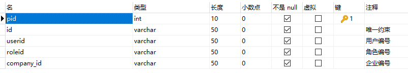
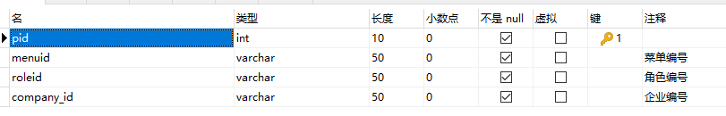
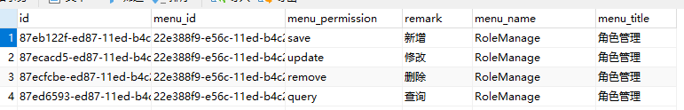
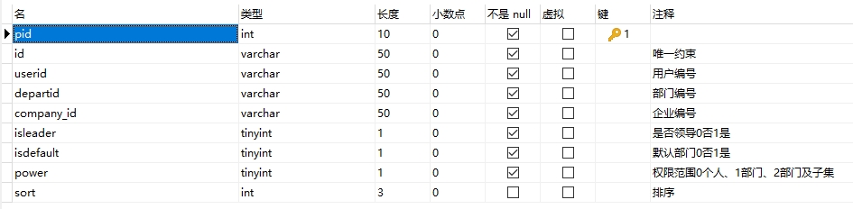
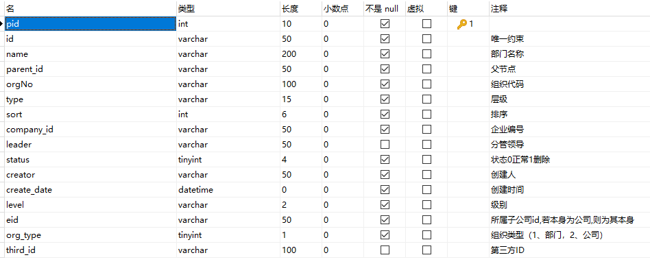
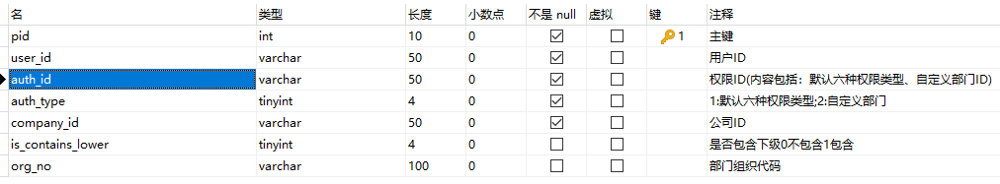

1. 用户表
sys_user
   - id
   - username
   - password
   - company_id
   - is_admin
   - power 权限0本人1本部门2本部门及下属3全部
   - is_first_login
   - status

2. 用户-角色关联表
sys_user_role
   - id
   - role_id
   - user_id
   - company_id
   - status

3. 角色表
sys_role
   - id
   - role_key
   - company_id
   - parent_id
   - remark
   - status

4. 角色-菜单关联表
sys_role_menu
   - id
   - menu_id
   - role_id
   - company_id
   - status

5. 菜单表 --> 前端动态菜单路由
sys_menu
   - id
   - menu_title 中文菜单标题
   - menu_name 英文菜单标题
   - url 菜单url
   - params 菜单路径参数
   - menu_icon
   - parent_id 父级菜单id，没有父级则为-1
   - company_id
   - is_admin_menu admin专用菜单
   - sort
   - status

6. 菜单权限表 --> 菜单及其所需要的crud权限
sys_menu_permission
   - id
   - menu_id
   - menu_title 菜单标题
   - menu_name 菜单名称
   - menu_permission 菜单权限
   - remark 权限描述
   - status

7. 用户-部门关联表
sys_user_dept
   - id
   - user_id
   - dept_id
   - company_id
   - is_leader 是否领导0否1是
   - is_default 默认部门0否1是
   - power 权限范围0个人、1部门、2部门及子集
   - sort
   - status

8. 部门表
sys_dept
   - id
   - dept_name

9. 数据权限表
sys_user_auth
   - id
   - user_id 用户ID
   - auth_id 权限ID(内容包括：默认六种权限类型、自定义部门ID)
   - auth_type 1:默认六种权限类型;2:自定义部门
   - company_id 公司ID
   - is_contains_lower 是否包含下级0不包含1包含
   - org_no 部门组织代码
   - status
